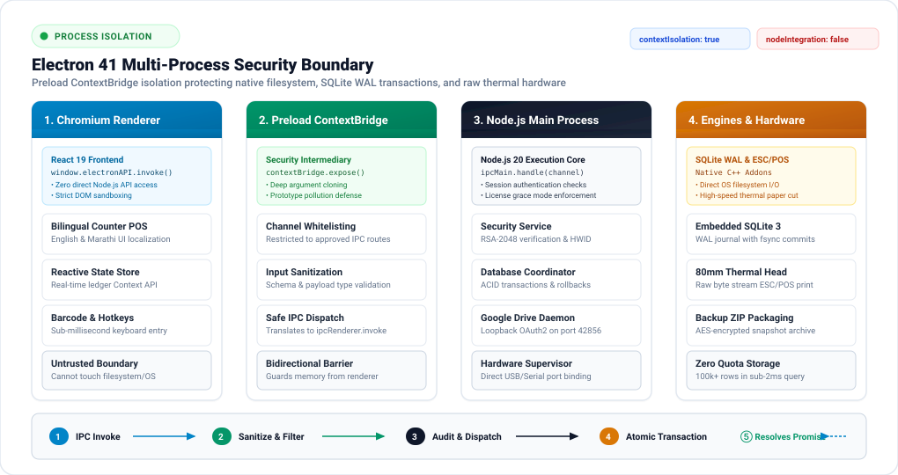

<div align="center">

  

  <h1>ScaleERP</h1>

  <p><b>High-velocity, offline-first enterprise ERP and counter billing engine engineered for wholesale distributors, godown operators, and agro-retail networks.</b></p>

  <p>
    <a href="https://scaleerp.vercel.app"></a>
    <a href="https://github.com/adityapawar112/ScaleERP-Web"></a>
    
    
    
    
    
    
  </p>

  <p>
    <a href="https://scaleerp.vercel.app"><b>Explore Live Cloud Portal</b></a> &nbsp;•&nbsp;
    <a href="docs/README.md"><b>Architecture &amp; Engineering Specs</b></a> &nbsp;•&nbsp;
    <a href="https://github.com/adityapawar112/ScaleERP-Web"><b>ScaleERP-Web Repository</b></a> &nbsp;•&nbsp;
    <a href="#-quickstart--installation"><b>Developer Setup</b></a> &nbsp;•&nbsp;
    <a href="docs/CHANGELOG.md"><b>Changelog</b></a>
  </p>

</div>

---

## ⚡ Executive Overview & Dual-Repository Ecosystem

ScaleERP is a unified full-stack ecosystem engineered to solve the operational vulnerabilities of generic cloud software in regional commerce hubs and rural godowns. It is split into two standalone repositories:

1. **`ScaleERP-Desktop` (This Repository)**: The client application installed on the store workstation. Built with Electron 41, React 19, and an embedded SQLite 3 engine running in Write-Ahead Logging (WAL) mode. It provides sub-millisecond counter billing, native 80mm ESC/POS thermal printing, and complete operational autonomy during internet blackouts.
2. **[`ScaleERP-Web`](https://github.com/adityapawar112/ScaleERP-Web) (Companion Cloud Repository)**: The central control plane live at [scaleerp.vercel.app](https://scaleerp.vercel.app). Built with Next.js 15 App Router and Supabase PostgreSQL. It acts as the cryptographic root of trust, issuing machine-bound RSA-2048 signed `.lic` blobs, auditing telemetry heartbeats, and hosting public technical documentation.

```
┌─────────────────────────────────────────────────────────────────────────────────────────────┐
│                                   SCALEERP UNIFIED ECOSYSTEM                                │
│                                                                                             │
│   [Store Workstation: ScaleERP-Desktop]            [Cloud Plane: ScaleERP-Web]              │
│   • Sub-ms Counter Billing (React 19)              • Central Web Portal (Next.js 15)        │
│   • Embedded Relational Data (SQLite WAL)          • PostgreSQL Entitlements (Supabase)     │
│   • 80mm ESC/POS Thermal Printing                  • RSA-2048 Asymmetric Signature Minter   │
│   • SHA-256 Hardware Fingerprint Check             • Anti-Tamper Telemetry & Audit Logs     │
│                     │                                             │                         │
│                     └─────── HTTPS Activation & Heartbeats ───────┘                         │
│                              (Signed .lic Envelope Handshake)                               │
└─────────────────────────────────────────────────────────────────────────────────────────────┘
```

---

## 🏛️ System Architecture & Process Topology

Below is the verified structural topology of the ScaleERP ecosystem, contrasting local workstation components with the cloud control plane:

<div align="center">
  
</div>

---

## 📊 Operational Metric Comparison

Most commercial ERPs (such as Zoho, SAP, and TallyPrime) force compromise between modern interfaces and offline resilience. ScaleERP delivers both:

| Architectural Metric | Traditional Cloud SaaS (SAP / Zoho) | Legacy Desktop (Tally) | ScaleERP Architecture |
| :--- | :---: | :---: | :--- |
| **Network Reliability** | Fails during internet dropouts | Offline only | **100% Offline Autonomy** with optional cloud telemetry |
| **Storage Engine** | Remote API / Browser Cache | Proprietary flat file | **Embedded SQLite 3 (WAL)** with ACID guarantees |
| **Licensing Validation** | Remote JWT OAuth check | Opaque serial dongle | **Asymmetric RSA-2048** signed machine certificates |
| **Hardware Integration** | Generic browser print prompt | Raw Windows driver | **Direct 80mm ESC/POS** thermal printing |
| **Cloud Disaster Recovery** | Vendor lock-in storage | Manual USB copies | **Loopback OAuth2 Google Drive** backup sync |
| **Interface Velocity** | High latency web forms | Keyboard-only terminal | **Sub-millisecond React 19** reactive counter POS |
| **Bilingual Support** | English only | Inconsistent fonts | **Native English & Marathi** localized typography |

---

## 🧱 Core Engineering Highlights

<table>
  <tr>
    <td width="50%" valign="top">
      <h3>🏪 Sub-Millisecond Counter Billing</h3>
      <p>Built for high-volume retail counters handling hundreds of transactions daily. Features instant product search, barcode processing, automatic tax calculations, and split payments.</p>
      <ul>
        <li>Dual payment methods: Cash and UPI settlement splits.</li>
        <li>Batch invoice numbering with sequential year prefixes.</li>
        <li>Automatic customer and broker ledger balance updates.</li>
        <li>Complete stock rollback on transaction deletion.</li>
      </ul>
    </td>
    <td width="50%" valign="top">
      <h3>🗄️ SQLite 3 Engine in WAL Mode</h3>
      <p>Operates directly on the host filesystem via native C++ bindings, eliminating browser IndexedDB quotas and network latency.</p>
      <ul>
        <li>Write-Ahead Logging enables concurrent reads during writes.</li>
        <li>Sub-2ms indexed queries across 100,000+ transaction rows.</li>
        <li>Atomic commit and rollback guarantees data integrity.</li>
        <li>Automated SQLite backup routines scheduled via node-cron.</li>
      </ul>
    </td>
  </tr>
  <tr>
    <td width="50%" valign="top">
      <h3>🖨️ Direct 80mm ESC/POS Thermal Printing</h3>
      <p>Bypasses the OS print dialog for instant counter receipts, with intelligent digital fallbacks for paperless communication.</p>
      <ul>
        <li>Native ESC/POS command generation for USB and serial printers.</li>
        <li>Dual-stack A4 and compact A5 layout switching.</li>
        <li>Headless PDF generation with corporate branding.</li>
        <li>One-click customer sharing via WhatsApp Web and desktop.</li>
      </ul>
    </td>
    <td width="50%" valign="top">
      <h3>🛡️ Cryptographic Tamper Shield</h3>
      <p>Protects local business logic and licensing state through asymmetric cryptography and hardware binding.</p>
      <ul>
        <li>SHA-256 machine fingerprinting from CPU, MAC, and OS identifiers.</li>
        <li>RSA-2048 asymmetric signature validation with PSS padding.</li>
        <li>24-hour chronometric drift guard detects clock manipulation.</li>
        <li>Cryptographic challenge-response protocol for offline password resets.</li>
      </ul>
    </td>
  </tr>
</table>

---

## 🔒 Multi-Process Security Boundary

Electron applications risk security vulnerabilities when the renderer process has direct filesystem or Node.js access. ScaleERP strictly enforces process isolation with a sandboxed Chromium renderer, ContextBridge whitelist validation, and isolated Node.js services:

<div align="center">
  
</div>

---

## 🔬 Systems Engineering Trade-Offs

<details>
<summary><b>Why SQLite WAL Mode over IndexedDB or WebSQL</b></summary>

1. **Storage Limits**: IndexedDB is bounded by browser eviction policies and arbitrary storage quotas. SQLite on the local filesystem handles gigabyte-scale datasets with zero quota restrictions.
2. **Transaction Concurrency**: Standard SQLite locks the entire database file during writes. Write-Ahead Logging (WAL) writes changes to a separate log file, allowing concurrent read queries while a write transaction is executing.
3. **Data Recovery**: In sudden power failure events common in industrial godowns, WAL mode guarantees atomic recovery upon restart without database corruption.
</details>

<details>
<summary><b>Why Asymmetric RSA-2048 Signatures over Online Auth Tokens</b></summary>

1. **Air-Gapped Validation**: Traditional SaaS platforms require periodic online token refreshes. ScaleERP signs `.lic` files using an RSA-2048 private key on the cloud server. The desktop app verifies the cryptographic signature locally using an embedded public key, requiring zero internet connectivity.
2. **Machine Fingerprinting**: Each `.lic` payload contains a SHA-256 hash computed from host hardware variables (CPU model, motherboard UUID, MAC address). Copying the database or license file to another machine invalidates the cryptographic signature.
3. **Tamper Auditing**: The application maintains a chronometric log. If the local workstation clock is rolled back by more than 24 hours to bypass an expiry date, the security service triggers a tamper lockout until verified by the vendor.
</details>

<details>
<summary><b>Why Local Loopback OAuth for Google Drive Cloud Backups</b></summary>

1. **No Intermediary Proxies**: ScaleERP starts an ephemeral HTTP server on `127.0.0.1:42856` to capture Google Drive OAuth codes directly via PKCE, removing the need for a third-party token exchange proxy.
2. **Durable Queueing**: Database backups created while offline enter a local sync queue. When connectivity restores, the service automatically transfers compressed, encrypted database snapshots to the user's private Google Drive.
</details>

---

## 🚀 Quickstart & Installation

### Prerequisites
- Node.js 20+ LTS
- npm 10+
- Git

### 1. Clone & Install Dependencies
```bash
git clone https://github.com/adityapawar112/ScaleERP-Desktop.git
cd ScaleERP-Desktop
npm install
```

### 2. Development Workflows
```bash
# Run the Vite React frontend in browser mode (Port 5173)
npm run dev

# Run the complete Electron multi-process desktop app with hot reload
npm run electron-dev
```

### 3. Run Test Suite
ScaleERP uses Vitest for testing unit logic, database managers, and security services:
```bash
npm run test
```
*Expected test outcome: 15 passing tests across 4 test suites.*

### 4. Production Packaging
```bash
# Compile TypeScript, copy schemas, and audit build safety
npm run build-all

# Generate Windows NSIS installer and standalone portable zip
npm run dist
```
Distributable binaries are placed in `dist/` (`ScaleERP-Setup-1.0.0.exe` and `ScaleERP-Portable-1.0.0.zip`).

---

## 📖 Technical Documentation Hub

Detailed engineering specifications, database schemas, and protocol definitions are located in the [docs/](docs/README.md) directory:

| Section | Focus Area | Key Documents |
| :--- | :--- | :--- |
| **Architecture** | System design & patterns | [System Patterns](docs/architecture/system-patterns.md) • [Licensing Blueprint](docs/architecture/licensing-architecture.md) • [Reports Engine](docs/architecture/reports-architecture.md) • [Invoice Engine](docs/architecture/invoice-customization-engine.md) |
| **Licensing** | Security protocols & SOPs | [RSA Key Rotation SOP](docs/licensing/rsa-key-rotation-sop.md) • [Vendor Operations](docs/licensing/vendor-ops-guide.md) • [Production Readiness](docs/licensing/production-readiness.md) |
| **Database** | Schemas & transactions | [SQLite Schema & ERD](docs/database/schema.md) • [Database Operations](docs/database/operations.md) • [WAL Connection](docs/database/database-wal.md) |
| **IPC** | Main-Renderer interfaces | [IPC Channel Registry](docs/ipc/ipc-communication.md) • [Window API Reference](docs/ipc/api-reference.md) |
| **Services** | Core background daemons | [Auth & Challenge Reset](docs/services/auth-and-reset.md) • [Backup Scheduler](docs/services/backup-scheduler.md) • [Google Drive Sync](docs/services/google-drive-sync.md) |
| **Frontend** | React 19 UI & components | [Frontend Overview](docs/frontend/overview.md) • [Component Library](docs/frontend/components.md) • [Internationalization](docs/frontend/i18n.md) • [Excel Export](docs/frontend/excel-export.md) |
| **Changelog** | Version release history | [CHANGELOG.md](docs/CHANGELOG.md) |

---

## 📂 Project Directory Structure

```
ScaleERP-Desktop/
├── electron/                    # Electron main process & services
│   ├── main.ts                  # Application lifecycle entry point
│   ├── preload.ts               # ContextBridge secure IPC bridge
│   ├── database/                # SQLite WAL connection & schema migration
│   ├── ipc/                     # 50+ type-safe IPC channel handlers
│   ├── services/                # Licensing, Google Drive, security, and backup
│   └── __tests__/               # Vitest automated test suite
├── src/                         # React 19 frontend application
│   ├── App.tsx                  # Client router & navigation root
│   ├── components/              # Shared modals, tables, and invoice templates
│   ├── context/                 # Application state & real-time ledger context
│   ├── i18n/                    # English and Marathi translation dictionaries
│   ├── pages/                   # 21 operational retail & godown views
│   └── utils/                   # ExcelJS export, formatting, and calculation
├── docs/                        # Authoritative engineering documentation
│   ├── architecture/            # System patterns and licensing specs
│   ├── database/                # SQLite schemas, tables, and operations
│   ├── licensing/               # RSA procedures and security testing
│   ├── ipc/                     # Inter-process interface contracts
│   ├── services/                # Cloud sync and background worker specs
│   └── assets/                  # High-resolution architectural diagrams
├── scripts/                     # Build verification and obfuscation tools
├── vendor/                      # Offline key generation and support utilities
└── package.json                 # Dependency definitions and scripts
```

---

## ⚖️ License & Intellectual Property

ScaleERP is developed by Aditya Pawar. Core client modules and architecture are shared under the [MIT License](LICENSE), with proprietary cloud licensing mechanisms managed independently.
