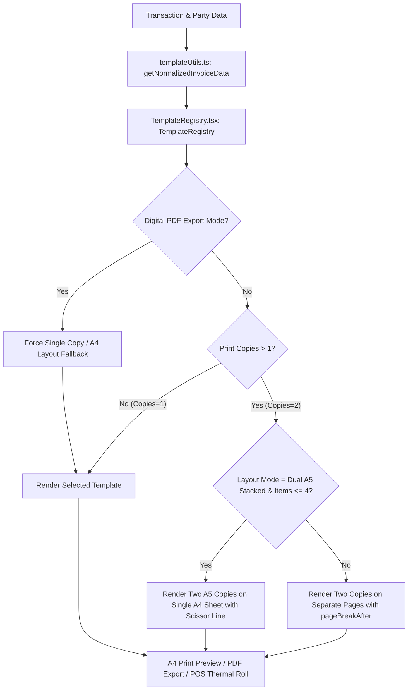

# Advanced Invoice & Customization Engine Architecture

This document explains the design, architecture, and step-by-step implementation of the ScaleERP Advanced Invoice & Customization Engine. It is structured to serve as an integration blueprint for developers wishing to implement a similar customizable invoice system in any web or desktop application with billing.

---

## 1. Architectural Design Overview

The ScaleERP invoice engine decouples visual presentation from underlying data schemas. It supports multiple layout styles (Standard A4, Modern Clean, Compact A5, Thermal POS 80mm), physical multi-copy printing configurations, client-side brand asset optimization, and digital sharing fallbacks.



### Core Architecture Components

1. **Schema Normalization Layer (`templateUtils.ts`)**: Translates distinct business models (e.g., retail sales vs. wholesale broker transactions) into a uniform interface for visual template components.
2. **Template Registry (`TemplateRegistry.tsx`)**: Coordinates visual styles, layout settings, page breaks, and physical multi-copy print modes at runtime.
3. **Dynamic Styling & Themes**: Uses dynamic accent color styling passed to components as styling props to colorize headers, outstanding balances, and total tables.
4. **Repeating Print Headers**: Formats templates using standard HTML `<table>` elements with branding assets defined inside `<thead>` to naturally guarantee header repetition across multi-page printed sheets.
5. **Optimize-on-Upload Brand Pipeline**: Optimizes uploaded assets on the client side using HTML5 `<canvas>` before saving, reducing storage space.
6. **Local Asset Resolution**: Employs an IPC service to bypass desktop security policies (`file:///` protocols) by loading filesystem assets as Base64 Data URLs at runtime.
7. **Digital Fallback Interceptor**: Automatically overrides multi-copy configurations and thermal receipt formats to a single A4 corporate template when generating digital PDFs for WhatsApp or download.
8. **PowerShell Clipboard Integration**: Copies generated PDF files directly to the OS clipboard, letting users paste the file (via Ctrl+V) in WhatsApp Desktop/Web instantly.

---

## 2. Dynamic Brand Asset Pipeline

To prevent database bloat and maintain high rendering performance, the system handles logo, banner, and payment QR code uploads through an optimization and local persistence workflow.

```mermaid
sequenceDiagram
    participant User as User (Settings UI)
    participant UI as Settings Page
    participant Canvas as HTML5 Canvas (imageOptimizer.ts)
    participant Backend as Electron Backend (handlers.ts)
    participant Disk as Local File System (userData/assets/branding/)
    
    User->>UI: Selects Image File
    UI->>Canvas: optimizeImage(file, options)
    Canvas-->>UI: Returns Base64 Optimized WebP/PNG
    UI->>Backend: IPC system:saveAsset(base64, filename)
    Backend->>Disk: Write optimized file to folder
    Backend-->>UI: Returns absolute file path
    UI->>Backend: IPC db:businessSettings:update(logoPath: path)
    
    Note over UI, Disk: Loading/Rendering Flow
    
    UI->>Backend: IPC system:readAssetAsBase64(logoPath)
    Backend->>Disk: Read binary file
    Backend-->>UI: Returns base64 Data URL (data:image/png;base64,...)
    UI->>User: Renders image inside 
```

### Client-Side Optimization (`imageOptimizer.ts`)
When a user uploads a branding asset (e.g., JPG, PNG), it is processed using HTML5 `<canvas>` before persistence:
- Enforces a maximum resolution bounding box (e.g., 1200px x 1200px) while maintaining aspect ratio.
- Compresses the image using WebP or PNG formats at a configured quality.
- Converts transparent backgrounds to white if converting to JPEG.
- Returns a lightweight Base64 string for file persistence.

### Local Storage & Resolution (`AssetImage.tsx`)
Because modern renderers block local filesystem URLs (`file:///`), the application uses an Electron IPC bridge helper:
1. **Storage**: The main process receives the Base64 data and writes it directly to disk under the user's local application data folder (`app.getPath('userData')/assets/branding/`).
2. **Database Reference**: Only the absolute disk path is stored in the SQLite settings table (e.g., `C:\Users\...\AppData\Roaming\ScaleERP\assets\branding\logo.png`).
3. **Retrieval**: The `<AssetImage>` React component requests the asset as a Base64 string from the backend using an IPC handler (`window.electronAPI.system.readAssetAsBase64`), loading it as a Data URL (`data:image/png;base64,...`) into the `src` attribute.

---

## 3. Physical Layouts and Stacking Modes

The engine supports physical print-oriented design styles to reduce printing costs and accommodate various print environments.

| Layout Template | Intended Use | Dimensions | Stacking Availability |
| :--- | :--- | :--- | :--- |
| **Standard A4** | Corporate & formal business billing | A4 (210mm x 297mm) | Single Copy / Multi-Page Separate Sheets |
| **Modern Clean** | Contemporary minimalist look | A4 (210mm x 297mm) | Single Copy / Multi-Page Separate Sheets |
| **Compact A5** | High-efficiency small order receipts | A5 (148mm x 210mm) | Single Copy / Dual Stacked on A4 Sheet |
| **Thermal 80mm** | Point of Sale (POS) roll receipts | Continuous Roll (80mm width) | Single Copy Continuous Roll |

### Multi-Copy Printing Layouts
For record-keeping, businesses often require two invoice copies (e.g., Customer Copy + Office Copy). The system handles this in two modes:

1. **Separate Pages Mode**: Renders Copy 1 and Copy 2 sequentially. It inserts a CSS print instruction wrapper:
   ```css
   .invoice-page-wrapper {
     page-break-after: always;
   }
   ```
2. **Dual Stacked (A5-on-A4) Mode**: To save paper, the system stacks two A5 Compact templates vertically on a single A4 page.
   - It separates the copies with a dashed scissor cut-line (`✂ Cut Here ✂`).
   - **Intelligent Overflow Guard**: If the transaction contains more than 4 items, the template would overflow a single A4 sheet. The engine automatically bypasses the stacked configuration, falling back to separate full pages so that no item lines are cut off.

---

## 4. Digital Interceptions and PDF Fallbacks

While thermal rolls and stacked A5 formats are useful for physical printing, they do not scale well for electronic sharing (such as downloading or sending via WhatsApp).

```
Manual Preview Mode (e.g., ThermalPOS) 
     │
     ▼
Trigger WhatsApp / Download PDF 
     │
     ▼
Intercept Settings via State Overrides
 ├─ Force Template: Standard A4
 ├─ Force Copies: 1 Copy
 └─ Set Mode: PDF
     │
     ▼
Headless PDF Generation (electron printToPDF)
     │
     ▼
Reset UI to Print Preview Mode (e.g., ThermalPOS)
```

During digital export, the modal intercepts layout parameters:
- **Format Override**: If the default layout is set to `thermal_80mm`, it forces rendering to `standard_a4` for the PDF export.
- **Copy Count Override**: Multi-copy modes are disabled; only a single digital copy is exported.
- **Background Delay**: A brief delay (800ms) allows the React DOM to re-render in PDF mode before generating the file buffer on the backend.

---

## 5. Step-by-Step Implementation Blueprint

Follow this checklist to implement this invoice customization engine in another application.

### Step 1: Database Schema Integration
Create or expand your settings table to support customizable branding assets, default templates, and layout configurations.

```sql
CREATE TABLE IF NOT EXISTS business_settings (
  id TEXT PRIMARY KEY,
  business_name TEXT,
  proprietor_name TEXT,
  address TEXT,
  phone_numbers TEXT, -- JSON array of phone numbers
  logo_path TEXT, -- Local path or URL to company logo
  header_banner_path TEXT, -- Local path or URL to banner header
  qr_code_path TEXT, -- Local path or URL to payment QR code
  default_invoice_template TEXT DEFAULT 'standard_a4',
  invoice_accent_color TEXT DEFAULT '#2563eb',
  print_copies INTEGER DEFAULT 1,
  print_layout_mode TEXT DEFAULT 'single', -- 'single' or 'dual_compact'
  custom_footer_text TEXT,
  invoice_whatsapp_template TEXT
);
```

### Step 2: Implement Client-Side Image Optimizer
Integrate the canvas optimizer utility to compress user-uploaded image files.

```typescript
// utils/imageOptimizer.ts
export interface OptimizeOptions {
  maxWidth?: number;
  maxHeight?: number;
  quality?: number;
  outputType?: string;
}

export async function optimizeImage(file: File | Blob, options: OptimizeOptions = {}): Promise<string> {
  const { maxWidth = 1200, maxHeight = 1200, quality = 0.85, outputType = 'image/webp' } = options;

  return new Promise((resolve, reject) => {
    const img = new Image();
    const objectUrl = URL.createObjectURL(file);

    img.onload = () => {
      URL.revokeObjectURL(objectUrl);
      let { width, height } = img;

      if (width > maxWidth || height > maxHeight) {
        const ratio = Math.min(maxWidth / width, maxHeight / height);
        width = Math.round(width * ratio);
        height = Math.round(height * ratio);
      }

      const canvas = document.createElement('canvas');
      canvas.width = width;
      canvas.height = height;
      const ctx = canvas.getContext('2d');
      if (!ctx) return reject(new Error('Canvas context unavailable'));

      if (outputType === 'image/jpeg') {
        ctx.fillStyle = '#FFFFFF';
        ctx.fillRect(0, 0, width, height);
      }

      ctx.drawImage(img, 0, 0, width, height);
      resolve(canvas.toDataURL(outputType, quality));
    };

    img.onerror = () => {
      URL.revokeObjectURL(objectUrl);
      reject(new Error('Image load failed'));
    };
    img.src = objectUrl;
  });
}
```

### Step 3: Implement Web/Desktop Asset Adapters
Adapt asset storage based on your runtime environment.

> [!NOTE]
> For web applications, replace Electron filesystem writes with cloud storage uploads (e.g., AWS S3, Supabase Storage) and resolve asset URLs directly from the cloud.

#### Electron (Desktop) Backend Storage Handler
```typescript
// main process handlers
import { ipcMain, app } from 'electron';
import * as fs from 'fs/promises';
import * as path from 'path';

ipcMain.handle('system:saveAsset', async (event, base64Data: string, fileName: string, subFolder: string) => {
  const targetDir = path.join(app.getPath('userData'), 'assets', subFolder);
  await fs.mkdir(targetDir, { recursive: true });
  
  // Extract binary data
  const matches = base64Data.match(/^data:([A-Za-z-+/]+);base64,(.+)$/);
  const buffer = Buffer.from(matches ? matches[2] : base64Data, 'base64');
  
  const safeFileName = path.basename(fileName);
  const absolutePath = path.join(targetDir, safeFileName);
  await fs.writeFile(absolutePath, buffer);
  
  return { success: true, path: absolutePath };
});

ipcMain.handle('system:readAssetAsBase64', async (event, absolutePath: string) => {
  const buffer = await fs.readFile(absolutePath);
  const ext = path.extname(absolutePath).toLowerCase();
  let mime = 'image/png';
  if (ext === '.jpg' || ext === '.jpeg') mime = 'image/jpeg';
  else if (ext === '.webp') mime = 'image/webp';
  
  return { success: true, dataUrl: `data:${mime};base64,${buffer.toString('base64')}` };
});
```

#### React AssetImage Loader Component
```typescript
// components/AssetImage.tsx
import React, { useState, useEffect } from 'react';

interface AssetImageProps extends React.ImgHTMLAttributes<HTMLImageElement> {
  assetPath?: string | null;
}

export const AssetImage: React.FC<AssetImageProps> = ({ assetPath, alt = 'Asset', ...props }) => {
  const [src, setSrc] = useState<string | null>(null);

  useEffect(() => {
    if (!assetPath) {
      setSrc(null);
      return;
    }
    
    // Desktop Mode: Load from local filesystem via Base64 IPC
    if (window.electronAPI) {
      window.electronAPI.system.readAssetAsBase64(assetPath)
        .then((res: any) => res?.success && setSrc(res.dataUrl))
        .catch(console.error);
    } else {
      // Web Mode: Standard URL loading
      setSrc(assetPath);
    }
  }, [assetPath]);

  if (!src) return null;
  return ;
};
```

### Step 4: Normalizer and Registry Layout
Implement `templateUtils.ts` to map your distinct invoices/bills to a single normalized structure, and configure `TemplateRegistry.tsx` to handle the rendering logic (single vs. double stacking, fallbacks, page break margins).

#### Styling Configuration: Edges and Repeat Headers
Use the following CSS rules in your printing stylesheet:
```css
@media print {
  @page {
    size: A4;
    margin: 0mm !important; /* Force browser to remove default page headers/footers */
  }
  
  body, html {
    margin: 0 !important;
    padding: 0 !important;
    background-color: white !important;
  }

  tr {
    page-break-inside: avoid !important;
  }
}

.invoice-template-container {
  box-sizing: border-box;
  padding: 10mm; /* Handle margin inside padding to ensure content does not touch physical paper edges */
}
```

To repeat branding headers on multi-page printouts, wrap the header in a `<thead>` tag inside a master table:
```tsx
export const InvoiceTemplate: React.FC<Props> = ({ businessSettings, items }) => {
  return (
    <div className="invoice-template-container">
      <table style={{ width: '100%', borderCollapse: 'collapse' }}>
        <thead>
          <tr>
            <th colSpan={5} style={{ border: 'none', textAlign: 'left', fontWeight: 'normal' }}>
              {/* Header branding banner & business logo - Repeats automatically */}
              <div className="invoice-header">
                <AssetImage assetPath={businessSettings.logoPath} />
                <h1>{businessSettings.businessName}</h1>
              </div>
            </th>
          </tr>
        </thead>
        <tbody>
          {/* Main invoice table rows */}
          {items.map(item => (
            <tr key={item.id}>
              <td>{item.name}</td>
              <td>{item.quantity}</td>
              <td>{item.price}</td>
            </tr>
          ))}
        </tbody>
      </table>
    </div>
  );
};
```

### Step 5: Digital Sharing Integration
For seamless document distribution:
1. **Background Rendering**: Render the single-copy A4 version inside the DOM.
2. **Headless Generation**: Extract the page as PDF.
3. **Clipboard and Link Sharing**: Save the PDF, copy it to the clipboard, and trigger a redirect URL or system action:
   - On Windows/Desktop, use PowerShell to copy the binary object to the system clipboard:
     ```powershell
     Set-Clipboard -Path 'C:\path\to\Invoice.pdf'
     ```
   - Launch WhatsApp via custom protocol handler:
     ```
     whatsapp://send?phone=919876543210&text=Your%20invoice%20message
     ```
     If the native protocol fails (e.g., client app is not installed), fall back to:
     ```
     https://wa.me/919876543210?text=Your%20invoice%20message
     ```
