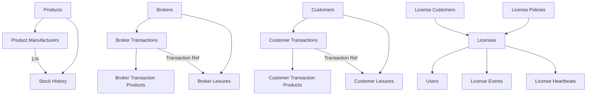

# Database Schema Documentation

Complete reference for the ScaleERP database schema, including all tables, relationships, indexes, and constraints.

## Schema Overview

The database consists of **28 tables** (12 core operational tables, 9 authentication & licensing tables, 3 backup & utility tables, 4 full-text search tables) organized into logical groups:

```
┌─────────────────────────────────────────────────────────────┐
│                      Core Entities                          │
│  ┌─────────────┐  ┌─────────────┐  ┌─────────────┐        │
│  │  Products    │  │   Brokers   │  │  Customers  │        │
│  └──────┬──────┘  └──────┬──────┘  └──────┬──────┘        │
│         │                │                │                 │
│         ▼                ▼                ▼                 │
│  ┌─────────────────────────────────────────────────────┐   │
│  │                    Transactions                      │   │
│  │  broker_transactions  │  customer_transactions       │   │
│  │  broker_transaction_products                         │   │
│  │  customer_transaction_products                       │   │
│  └─────────────────────────────────────────────────────┘   │
│                           │                                 │
│                           ▼                                 │
│  ┌─────────────────────────────────────────────────────┐   │
│  │                    Leisures                          │   │
│  │  broker_leisures  │  customer_leisures               │   │
│  └─────────────────────────────────────────────────────┘   │
└─────────────────────────────────────────────────────────────┘
```

## Core Entities

### Products Table

Stores inventory items with basic product information.

```sql
CREATE TABLE IF NOT EXISTS products (
    id TEXT PRIMARY KEY,
    name TEXT NOT NULL,
    description TEXT,
    price REAL DEFAULT 0,
    stock_quantity INTEGER DEFAULT 0,
    is_archived BOOLEAN DEFAULT FALSE,
    created_at DATETIME DEFAULT CURRENT_TIMESTAMP,
    updated_at DATETIME DEFAULT CURRENT_TIMESTAMP
);
```

| Column | Type | Description |
|--------|------|-------------|
| `id` | TEXT | Unique identifier (UUID format) |
| `name` | TEXT | Product name (required) |
| `description` | TEXT | Product description |
| `price` | REAL | Unit price |
| `stock_quantity` | INTEGER | Total stock across all manufacturers |
| `is_archived` | BOOLEAN | Soft delete flag |
| `created_at` | DATETIME | Record creation timestamp |
| `updated_at` | DATETIME | Last update timestamp |

**Indexes:**
- `idx_products_name` — For name-based searches
- `idx_products_is_archived` — For filtering archived products

---

### Product Manufacturers Table

Tracks stock levels per manufacturer for each product.

```sql
CREATE TABLE IF NOT EXISTS product_manufacturers (
    id TEXT PRIMARY KEY,
    product_id TEXT NOT NULL,
    manufacturer_id TEXT NOT NULL,
    manufacturer_name TEXT NOT NULL,
    quantity INTEGER DEFAULT 0,
    is_archived BOOLEAN DEFAULT FALSE,
    FOREIGN KEY (product_id) REFERENCES products(id) ON DELETE CASCADE,
    UNIQUE(product_id, manufacturer_id)
);
```

| Column | Type | Description |
|--------|------|-------------|
| `id` | TEXT | Unique identifier |
| `product_id` | TEXT | Reference to products table |
| `manufacturer_id` | TEXT | Manufacturer identifier |
| `manufacturer_name` | TEXT | Display name for manufacturer |
| `quantity` | INTEGER | Stock quantity for this manufacturer |
| `is_archived` | BOOLEAN | Soft delete flag |

**Constraints:**
- Foreign key to `products` with CASCADE delete
- Unique constraint on (product_id, manufacturer_id)

**Indexes:**
- `idx_product_manufacturers_product` — For product lookups
- `idx_product_manufacturers_manufacturer` — For manufacturer lookups
- `idx_product_manufacturers_is_archived` — For filtering

---

### Brokers Table

Stores supplier information and financial totals.

```sql
CREATE TABLE IF NOT EXISTS brokers (
    id TEXT PRIMARY KEY,
    name TEXT NOT NULL,
    contact TEXT,
    address TEXT,
    total_pending REAL DEFAULT 0,
    total_paid REAL DEFAULT 0,
    created_at DATETIME DEFAULT CURRENT_TIMESTAMP,
    updated_at DATETIME DEFAULT CURRENT_TIMESTAMP
);
```

| Column | Type | Description |
|--------|------|-------------|
| `id` | TEXT | Unique identifier |
| `name` | TEXT | Broker/supplier name (required) |
| `contact` | TEXT | Contact information |
| `address` | TEXT | Physical address |
| `total_pending` | REAL | Amount pending to pay |
| `total_paid` | REAL | Total amount paid |
| `created_at` | DATETIME | Record creation timestamp |
| `updated_at` | DATETIME | Last update timestamp |

**Indexes:**
- `idx_brokers_name` — For name-based searches

---

### Customers Table

Stores customer information and financial totals.

```sql
CREATE TABLE IF NOT EXISTS customers (
    id TEXT PRIMARY KEY,
    name TEXT NOT NULL,
    contact TEXT,
    address TEXT,
    total_pending REAL DEFAULT 0,
    total_paid REAL DEFAULT 0,
    created_at DATETIME DEFAULT CURRENT_TIMESTAMP,
    updated_at DATETIME DEFAULT CURRENT_TIMESTAMP
);
```

| Column | Type | Description |
|--------|------|-------------|
| `id` | TEXT | Unique identifier |
| `name` | TEXT | Customer name (required) |
| `contact` | TEXT | Contact information |
| `address` | TEXT | Physical address |
| `total_pending` | REAL | Amount pending to receive |
| `total_paid` | REAL | Total amount received |
| `created_at` | DATETIME | Record creation timestamp |
| `updated_at` | DATETIME | Last update timestamp |

**Indexes:**
- `idx_customers_name` — For name-based searches

---

## Transaction Tables

### Broker Transactions Table

Records purchases from suppliers.

```sql
CREATE TABLE IF NOT EXISTS broker_transactions (
    id TEXT PRIMARY KEY,
    broker_id TEXT NOT NULL,
    date TEXT NOT NULL,
    time TEXT,
    invoice_number TEXT,
    total_amount REAL NOT NULL,
    previous_balance REAL DEFAULT 0,
    payment_method TEXT CHECK(payment_method IN ('UPI', 'cash')) DEFAULT 'cash',
    notes TEXT,
    created_at DATETIME DEFAULT CURRENT_TIMESTAMP,
    FOREIGN KEY (broker_id) REFERENCES brokers(id) ON DELETE CASCADE
);
```

| Column | Type | Description |
|--------|------|-------------|
| `id` | TEXT | Unique identifier |
| `broker_id` | TEXT | Reference to brokers table |
| `date` | TEXT | Transaction date (YYYY-MM-DD) |
| `time` | TEXT | Transaction time (HH:MM:SS) |
| `invoice_number` | TEXT | Auto-generated invoice number (INV-YYYY-NNNN) |
| `total_amount` | REAL | Total transaction amount |
| `previous_balance` | REAL | Balance before transaction |
| `payment_method` | TEXT | 'UPI' or 'cash' |
| `notes` | TEXT | Transaction notes |
| `created_at` | DATETIME | Record creation timestamp |

**Constraints:**
- Foreign key to `brokers` with CASCADE delete
- Check constraint on `payment_method`

**Indexes:**
- `idx_broker_transactions_broker_date` — For broker transaction history
- `idx_broker_transactions_date` — For date-based queries

---

### Broker Transaction Products Table

Line items for broker transactions (many-to-many relationship).

```sql
CREATE TABLE IF NOT EXISTS broker_transaction_products (
    id TEXT PRIMARY KEY,
    transaction_id TEXT NOT NULL,
    product_id TEXT NOT NULL,
    manufacturer_id TEXT NOT NULL,
    units INTEGER NOT NULL,
    unit_type TEXT CHECK(unit_type IN ('tonnes', 'units')) DEFAULT 'units',
    rate REAL NOT NULL,
    total REAL NOT NULL,
    FOREIGN KEY (transaction_id) REFERENCES broker_transactions(id) ON DELETE CASCADE,
    FOREIGN KEY (product_id) REFERENCES products(id) ON DELETE CASCADE
);
```

| Column | Type | Description |
|--------|------|-------------|
| `id` | TEXT | Unique identifier |
| `transaction_id` | TEXT | Reference to broker_transactions |
| `product_id` | TEXT | Reference to products |
| `manufacturer_id` | TEXT | Manufacturer identifier |
| `units` | INTEGER | Quantity purchased |
| `unit_type` | TEXT | 'tonnes' or 'units' |
| `rate` | REAL | Price per unit |
| `total` | REAL | Line total (units × rate) |

**Constraints:**
- Foreign key to `broker_transactions` with CASCADE delete
- Foreign key to `products` with CASCADE delete
- Check constraint on `unit_type`

**Indexes:**
- `idx_broker_tx_products_tx` — For transaction lookups
- `idx_broker_tx_products_product` — For product lookups

---

### Customer Transactions Table

Records sales to customers.

```sql
CREATE TABLE IF NOT EXISTS customer_transactions (
    id TEXT PRIMARY KEY,
    customer_id TEXT,
    date TEXT NOT NULL,
    time TEXT,
    invoice_number TEXT,
    total_amount REAL NOT NULL,
    previous_balance REAL DEFAULT 0,
    payment_method TEXT CHECK(payment_method IN ('UPI', 'cash')) DEFAULT 'cash',
    notes TEXT,
    created_at DATETIME DEFAULT CURRENT_TIMESTAMP,
    FOREIGN KEY (customer_id) REFERENCES customers(id) ON DELETE SET NULL
);
```

| Column | Type | Description |
|--------|------|-------------|
| `id` | TEXT | Unique identifier |
| `customer_id` | TEXT | Reference to customers (nullable) |
| `date` | TEXT | Transaction date (YYYY-MM-DD) |
| `time` | TEXT | Transaction time (HH:MM:SS) |
| `invoice_number` | TEXT | Auto-generated invoice number (CUST-INV-YYYY-NNNN) |
| `total_amount` | REAL | Total transaction amount |
| `previous_balance` | REAL | Balance before transaction |
| `payment_method` | TEXT | 'UPI' or 'cash' |
| `notes` | TEXT | Transaction notes |
| `created_at` | DATETIME | Record creation timestamp |

**Constraints:**
- Foreign key to `customers` with SET NULL on delete (allows anonymous sales)
- Check constraint on `payment_method`

**Indexes:**
- `idx_customer_transactions_customer_date` — For customer transaction history
- `idx_customer_transactions_date` — For date-based queries

---

### Customer Transaction Products Table

Line items for customer transactions (many-to-many relationship).

```sql
CREATE TABLE IF NOT EXISTS customer_transaction_products (
    id TEXT PRIMARY KEY,
    transaction_id TEXT NOT NULL,
    product_id TEXT NOT NULL,
    manufacturer_id TEXT NOT NULL,
    quantity INTEGER NOT NULL,
    unit_type TEXT CHECK(unit_type IN ('tonnes', 'units')) DEFAULT 'units',
    price REAL NOT NULL,
    labour REAL DEFAULT 0,
    total REAL NOT NULL,
    FOREIGN KEY (transaction_id) REFERENCES customer_transactions(id) ON DELETE CASCADE,
    FOREIGN KEY (product_id) REFERENCES products(id) ON DELETE CASCADE
);
```

| Column | Type | Description |
|--------|------|-------------|
| `id` | TEXT | Unique identifier |
| `transaction_id` | TEXT | Reference to customer_transactions |
| `product_id` | TEXT | Reference to products |
| `manufacturer_id` | TEXT | Manufacturer identifier |
| `quantity` | INTEGER | Quantity sold |
| `unit_type` | TEXT | 'tonnes' or 'units' |
| `price` | REAL | Selling price per unit |
| `labour` | REAL | Labour charges |
| `total` | TEXT | Line total (quantity × price + labour) |

**Constraints:**
- Foreign key to `customer_transactions` with CASCADE delete
- Foreign key to `products` with CASCADE delete
- Check constraint on `unit_type`

**Indexes:**
- `idx_customer_tx_products_tx` — For transaction lookups
- `idx_customer_tx_products_product` — For product lookups

---

## Payment Tables

### Broker Leisures Table

Tracks payments made to suppliers.

```sql
CREATE TABLE IF NOT EXISTS broker_leisures (
    id TEXT PRIMARY KEY,
    broker_id TEXT NOT NULL,
    broker_name TEXT NOT NULL,
    type TEXT CHECK(type IN ('purchase', 'payable')) NOT NULL,
    amount REAL NOT NULL,
    transaction_id TEXT,
    payment_method TEXT CHECK(payment_method IN ('UPI', 'Cash')),
    date TEXT NOT NULL,
    time TEXT,
    notes TEXT,
    created_at DATETIME DEFAULT CURRENT_TIMESTAMP,
    FOREIGN KEY (broker_id) REFERENCES brokers(id) ON DELETE CASCADE,
    FOREIGN KEY (transaction_id) REFERENCES broker_transactions(id) ON DELETE SET NULL
);
```

| Column | Type | Description |
|--------|------|-------------|
| `id` | TEXT | Unique identifier |
| `broker_id` | TEXT | Reference to brokers |
| `broker_name` | TEXT | Denormalized broker name |
| `type` | TEXT | 'purchase' or 'payable' |
| `amount` | REAL | Payment amount |
| `transaction_id` | TEXT | Optional reference to transaction |
| `payment_method` | TEXT | 'UPI' or 'Cash' |
| `date` | TEXT | Payment date |
| `time` | TEXT | Payment time |
| `notes` | TEXT | Payment notes |
| `created_at` | DATETIME | Record creation timestamp |

**Type Meanings:**
- `purchase` — New purchase transaction
- `payable` — Payment made against pending balance

**Indexes:**
- `idx_broker_leisures_broker_date` — For broker payment history

---

### Customer Leisures Table

Tracks payments received from customers.

```sql
CREATE TABLE IF NOT EXISTS customer_leisures (
    id TEXT PRIMARY KEY,
    customer_id TEXT NOT NULL,
    customer_name TEXT NOT NULL,
    type TEXT CHECK(type IN ('receivable', 'sale')) NOT NULL,
    amount REAL NOT NULL,
    transaction_id TEXT,
    payment_method TEXT CHECK(payment_method IN ('UPI', 'Cash')),
    date TEXT NOT NULL,
    time TEXT,
    notes TEXT,
    created_at DATETIME DEFAULT CURRENT_TIMESTAMP,
    FOREIGN KEY (customer_id) REFERENCES customers(id) ON DELETE CASCADE,
    FOREIGN KEY (transaction_id) REFERENCES customer_transactions(id) ON DELETE SET NULL
);
```

| Column | Type | Description |
|--------|------|-------------|
| `id` | TEXT | Unique identifier |
| `customer_id` | TEXT | Reference to customers |
| `customer_name` | TEXT | Denormalized customer name |
| `type` | TEXT | 'receivable' or 'sale' |
| `amount` | REAL | Payment amount |
| `transaction_id` | TEXT | Optional reference to transaction |
| `payment_method` | TEXT | 'UPI' or 'Cash' |
| `date` | TEXT | Payment date |
| `time` | TEXT | Payment time |
| `notes` | TEXT | Payment notes |
| `created_at` | DATETIME | Record creation timestamp |

**Type Meanings:**
- `sale` — New sale transaction
- `receivable` — Payment received against pending balance

**Indexes:**
- `idx_customer_leisures_customer_date` — For customer payment history

---

## Audit Table

### Stock History Table

Complete audit trail for all stock changes.

```sql
CREATE TABLE IF NOT EXISTS stock_history (
    id TEXT PRIMARY KEY,
    product_id TEXT NOT NULL,
    date TEXT NOT NULL,
    time TEXT,
    type TEXT CHECK(type IN ('in', 'out')) NOT NULL,
    quantity INTEGER NOT NULL,
    notes TEXT,
    broker_id TEXT,
    manufacturer_id TEXT,
    transaction_id TEXT,
    leisure_created BOOLEAN DEFAULT 0,
    created_at DATETIME DEFAULT CURRENT_TIMESTAMP,
    FOREIGN KEY (product_id) REFERENCES products(id) ON DELETE CASCADE
);
```

| Column | Type | Description |
|--------|------|-------------|
| `id` | TEXT | Unique identifier |
| `product_id` | TEXT | Reference to products |
| `date` | TEXT | Change date |
| `time` | TEXT | Change time |
| `type` | TEXT | 'in' (stock increase) or 'out' (stock decrease) |
| `quantity` | INTEGER | Quantity changed |
| `notes` | TEXT | Change description |
| `broker_id` | TEXT | Related broker (if applicable) |
| `manufacturer_id` | TEXT | Related manufacturer |
| `transaction_id` | TEXT | Related transaction |
| `leisure_created` | BOOLEAN | Whether leisure was created |
| `created_at` | DATETIME | Record creation timestamp |

**Indexes:**
- `idx_stock_history_product_date` — For product history
- `idx_stock_history_type_date` — For type-based queries

---

## Configuration Tables

### Business Settings Table

Application-wide business configuration.

```sql
CREATE TABLE IF NOT EXISTS business_settings (
    id INTEGER PRIMARY KEY CHECK (id = 1),
    business_name TEXT,
    address TEXT,
    proprietor_name TEXT,
    phone_numbers TEXT,
    updated_at DATETIME DEFAULT CURRENT_TIMESTAMP
);
```

| Column | Type | Description |
|--------|------|-------------|
| `id` | INTEGER | Always 1 (single row) |
| `business_name` | TEXT | Business name |
| `address` | TEXT | Business address |
| `proprietor_name` | TEXT | Owner/proprietor name |
| `phone_numbers` | TEXT | JSON array of phone numbers |
| `updated_at` | DATETIME | Last update timestamp |

---

### Backup Settings Table

Configuration for automated backups.

```sql
CREATE TABLE IF NOT EXISTS backup_settings (
    id INTEGER PRIMARY KEY CHECK (id = 1),
    auto_backup_enabled BOOLEAN DEFAULT 1,
    backup_frequency TEXT CHECK(backup_frequency IN ('daily', 'weekly', 'monthly')) DEFAULT 'weekly',
    backup_location TEXT NOT NULL,
    updated_at DATETIME DEFAULT CURRENT_TIMESTAMP
);
```

| Column | Type | Description |
|--------|------|-------------|
| `id` | INTEGER | Always 1 (single row) |
| `auto_backup_enabled` | BOOLEAN | Enable/disable auto backup |
| `backup_frequency` | TEXT | 'daily', 'weekly', or 'monthly' |
| `backup_location` | TEXT | Backup directory path |
| `updated_at` | DATETIME | Last update timestamp |

---

### Backup History Table

Log of all backup operations.

```sql
CREATE TABLE IF NOT EXISTS backup_history (
    id TEXT PRIMARY KEY,
    timestamp TEXT NOT NULL,
    type TEXT CHECK(type IN ('auto', 'manual', 'pre_operation', 'pre_restore')) NOT NULL,
    path TEXT NOT NULL,
    size_bytes INTEGER,
    success BOOLEAN DEFAULT 1,
    error_message TEXT,
    frequency_type TEXT,
    created_at DATETIME DEFAULT CURRENT_TIMESTAMP
);
```

| Column | Type | Description |
|--## Full-Text Search Tables

FTS5 virtual tables for fast text search:

```sql
-- Products FTS
CREATE VIRTUAL TABLE IF NOT EXISTS products_fts USING fts5(
    name, description,
    content=products,
    content_rowid=rowid
);

-- Brokers FTS
CREATE VIRTUAL TABLE IF NOT EXISTS brokers_fts USING fts5(
    name, contact, address,
    content=brokers,
    content_rowid=rowid
);

-- Customers FTS
CREATE VIRTUAL TABLE IF NOT EXISTS customers_fts USING fts5(
    name, contact, address,
    content=customers,
    content_rowid=rowid
);

-- Users FTS
CREATE VIRTUAL TABLE IF NOT EXISTS users_fts USING fts5(
    username,
    content=users,
    content_rowid=rowid
);
```

### Triggers for FTS Sync
Triggers automatically sync FTS tables with source tables on `INSERT`, `UPDATE`, and `DELETE` for `products`, `brokers`, `customers`, and `users`.

---

## Authentication & Licensing Tables

### Users Table
Stores administrative application users.

```sql
CREATE TABLE IF NOT EXISTS users (
    user_id TEXT PRIMARY KEY,
    username TEXT NOT NULL UNIQUE,
    password_hash TEXT NOT NULL,
    license_id TEXT NOT NULL,
    created_at DATETIME DEFAULT CURRENT_TIMESTAMP,
    last_login DATETIME,
    locked_out BOOLEAN DEFAULT 0,
    failed_attempts INTEGER DEFAULT 0,
    max_failed_attempts INTEGER DEFAULT 5,
    FOREIGN KEY (license_id) REFERENCES licenses(license_id),
    CHECK (failed_attempts >= 0),
    CHECK (max_failed_attempts >= 1)
);
```

| Column | Type | Description |
|--------|------|-------------|
| `user_id` | TEXT | Unique identifier |
| `username` | TEXT | Unique login name |
| `password_hash` | TEXT | bcrypt hashed password |
| `license_id` | TEXT | Linked license reference |
| `last_login` | DATETIME | Last successful login timestamp |
| `locked_out` | BOOLEAN | Account lockout flag |
| `failed_attempts` | INTEGER | Invalid login counter |
| `max_failed_attempts` | INTEGER | Configurable lockout threshold |

### Licenses Table
Stores issued license metadata.

```sql
CREATE TABLE IF NOT EXISTS licenses (
    license_id TEXT PRIMARY KEY,
    customer_id TEXT NOT NULL,
    policy_id TEXT NOT NULL,
    status TEXT CHECK(status IN ('active', 'expired', 'revoked', 'renewed')) DEFAULT 'active',
    edition TEXT CHECK(edition IN ('Basic', 'Pro', 'Enterprise')) DEFAULT 'Pro',
    valid_from TEXT NOT NULL,
    valid_until TEXT NOT NULL,
    maintenance_until TEXT NOT NULL,
    device_fingerprint TEXT,
    license_blob TEXT NOT NULL,
    grace_until TEXT,
    grace_mode TEXT,
    created_at DATETIME DEFAULT CURRENT_TIMESTAMP,
    updated_at DATETIME DEFAULT CURRENT_TIMESTAMP,
    FOREIGN KEY (customer_id) REFERENCES license_customers(customer_id),
    FOREIGN KEY (policy_id) REFERENCES license_policies(policy_id)
);
```

| Column | Type | Description |
|--------|------|-------------|
| `license_id` | TEXT | License key / identifier |
| `customer_id` | TEXT | Linked license customer |
| `policy_id` | TEXT | Linked generation policy |
| `status` | TEXT | Active/Expired status |
| `edition` | TEXT | Edition variant |
| `valid_from` | TEXT | Activation date |
| `valid_until` | TEXT | Renewal date |
| `maintenance_until` | TEXT | Effective expiry date |
| `device_fingerprint` | TEXT | Associated hardware ID |
| `license_blob` | TEXT | Base64 RSA-signed JSON |
| `grace_until` | TEXT | Extension period timestamp |

### Security Heartbeats (license_heartbeats)
Used for clock tamper detection.

| Column | Type | Description |
|--------|------|-------------|
| `id` | TEXT | Unique identifier |
| `license_id` | TEXT | Reference to licenses table |
| `checked_at` | DATETIME | System operation time |
| `system_time_iso` | TEXT | Stored clock state |
| `reason` | TEXT | Trigger event |

### Password Reset Tokens
Hash-based token mechanism for credential recovery.

| Column | Type | Description |
|--------|------|-------------|
| `token_hash` | TEXT | SHA hash of the token |
| `expires_at` | DATETIME | Validity bounds |
| `used` | BOOLEAN | One-time usage flag |

### Used Reset Nonces
Prevents replay attacks during vendor-signed support resets.

| Column | Type | Description |
|--------|------|-------------|
| `nonce` | TEXT | Vendor-signed unique nonce |
| `license_id` | TEXT | License reference |
| `user_id` | TEXT | User reference |

### Clock Override Tokens
Allows support to issue one-time bypasses for tamper locks.

| Column | Type | Description |
|--------|------|-------------|
| `token_id` | TEXT | Unique identifier |
| `expires_at` | DATETIME | Token validity |
| `nonce` | TEXT | One-time payload |

### License Customers
Isolates software licensee data from internal business customers.

| Column | Type | Description |
|--------|------|-------------|
| `customer_id` | TEXT | Unique identifier |
| `name` | TEXT | Licensee name |
| `company` | TEXT | Organization name |
| `status` | TEXT | Customer standing |

### License Policies
Defines the reusable templates for generating specific license types.

| Column | Type | Description |
|--------|------|-------------|
| `policy_id` | TEXT | Unique identifier (e.g. annual-pro-1yr-90d) |
| `license_type` | TEXT | Trial/Subscription |
| `duration_days` | INTEGER | Renewal offset |
| `maintenance_days` | INTEGER | Hard lock offset |
| `features_json` | TEXT | JSON capability map |

### License Events
Append-only audit trail for status changes and renewals.

| Column | Type | Description |
|--------|------|-------------|
| `event_id` | TEXT | Unique identifier |
| `license_id` | TEXT | Associated license |
| `event_type` | TEXT | Category (e.g., status_changed) |
| `event_data` | TEXT | JSON contextual metrics |

---

## Utility Tables

### WhatsApp Presets Table
Message templates for WhatsApp integration.

| Column | Type | Description |
|--------|------|-------------|
| `id` | TEXT | Unique identifier |
| `title` | TEXT | Preset title |
| `message` | TEXT | Message template |
| `created_at` | DATETIME | Record creation timestamp |
| `updated_at` | DATETIME | Last update timestamp |

---

## Database Views

### Product Stock Summary
```sql
CREATE VIEW IF NOT EXISTS product_stock_summary AS
SELECT
    p.id,
    p.name,
    p.stock_quantity as total_stock,
    COUNT(pm.manufacturer_id) as manufacturer_count,
    SUM(pm.quantity) as calculated_stock,
    GROUP_CONCAT(pm.manufacturer_name || ': ' || pm.quantity, '; ') as manufacturer_breakdown
FROM products p
LEFT JOIN product_manufacturers pm ON p.id = pm.product_id
GROUP BY p.id, p.name, p.stock_quantity;
```

### Broker Transaction Summary
```sql
CREATE VIEW IF NOT EXISTS broker_transaction_summary AS
SELECT
    bt.id,
    bt.broker_id,
    b.name as broker_name,
    bt.date,
    bt.time,
    bt.invoice_number,
    bt.total_amount,
    bt.previous_balance,
    bt.payment_method,
    COUNT(btp.id) as product_count,
    GROUP_CONCAT(p.name || ' (' || btp.units || ' ' || btp.unit_type || ')', ', ') as products
FROM broker_transactions bt
JOIN brokers b ON bt.broker_id = b.id
LEFT JOIN broker_transaction_products btp ON bt.id = btp.transaction_id
LEFT JOIN products p ON btp.product_id = p.id
GROUP BY bt.id, bt.broker_id, b.name, bt.date, bt.time, bt.invoice_number, bt.total_amount, bt.previous_balance, bt.payment_method;
```

### Customer Transaction Summary
```sql
CREATE VIEW IF NOT EXISTS customer_transaction_summary AS
SELECT
    ct.id,
    ct.customer_id,
    c.name as customer_name,
    ct.date,
    ct.time,
    ct.invoice_number,
    ct.total_amount,
    ct.previous_balance,
    ct.payment_method,
    COUNT(ctp.id) as product_count,
    GROUP_CONCAT(p.name || ' (' || ctp.quantity || ' ' || ctp.unit_type || ')', ', ') as products
FROM customer_transactions ct
LEFT JOIN customers c ON ct.customer_id = c.id
LEFT JOIN customer_transaction_products ctp ON ct.id = ctp.transaction_id
LEFT JOIN products p ON ctp.product_id = p.id
GROUP BY ct.id, ct.customer_id, c.name, ct.date, ct.time, ct.invoice_number, ct.total_amount, ct.previous_balance, ct.payment_method;
```

---

## Performance Indexes

The system utilizes several composite and covering indexes to maintain high performance under load:

| Table | Index Columns | Purpose |
|-------|---------------|---------|
| `broker_transactions` | `(broker_id, date DESC)` | Fastest lookup for supplier history |
| `stock_history` | `(transaction_id)` | Critical for **Reverse Stock** operations |
| `license_heartbeats` | `(license_id, checked_at)` | Optimized tamper detection scans |
| `product_manufacturers` | `(product_id, manufacturer_id)` | Unique stock level enforcement |
| `users` | `(license_id)` | User-License traversal |

## Entity Relationship Diagram



## Related Documentation

- [Database Overview](database.md) — Connection management and setup
- [Database Operations](operations.md) — CRUD operations
- [IPC Communication](../IPC/ipc-communication.md) — Frontend access�────────────────┘       └─────────────┘
       │
       │ 1:N
       ▼
┌─────────────────────────────────────────┐
│         stock_history                    │
└─────────────────────────────────────────┘

┌─────────────┐       ┌─────────────────────┐
│   Brokers   │◄──────│  broker_transactions │
└──────┬──────┘       └──────────┬──────────┘
       │                        │
       │ 1:N                    │ 1:N
       ▼                        ▼
┌──────────────┐      ┌─────────────────────────┐
│ broker_leisures│◄────│ broker_transaction_products │
└──────────────┘      └─────────────────────────┘

┌─────────────┐       ┌──────────────────────┐
│  Customers  │◄──────│ customer_transactions │
└──────┬──────┘       └──────────┬───────────┘
       │                        │
       │ 1:N                    │ 1:N
       ▼                        ▼
┌───────────────┐     ┌──────────────────────────┐
│customer_leisures│◄──│customer_transaction_products│
└───────────────┘     └──────────────────────────┘
```

## Related Documentation

- [Database Overview](database.md) — Connection management and setup
- [Database Operations](operations.md) — CRUD operations
- [IPC Communication](../IPC/ipc-communication.md) — Frontend access