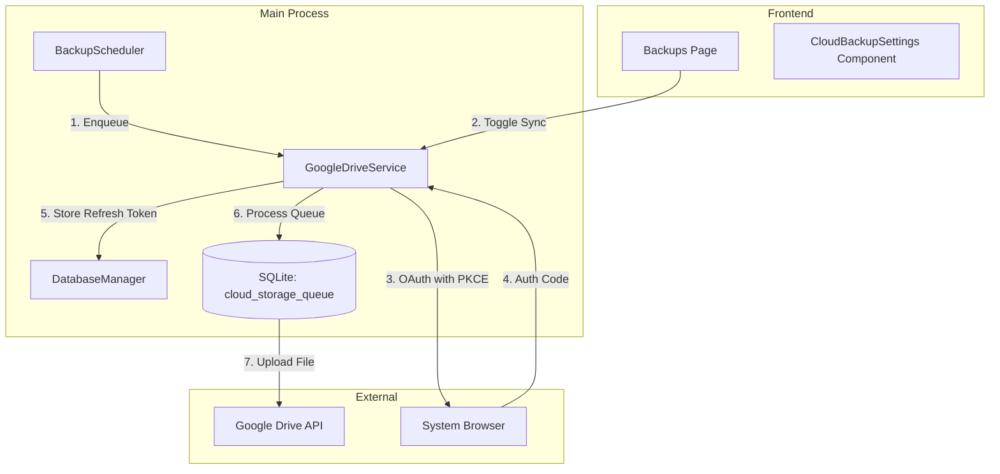

# Google Drive Cloud Sync Documentation

The `GoogleDriveService` manages automated and manual synchronization of database backups to a user's Google Drive account.

## Overview

| Aspect | Details |
|--------|---------|
| **Service** | `GoogleDriveService` |
| **Location** | `electron/services/googleDriveService.ts` |
| **Auth Type** | OAuth2 with PKCE (Desktop Flow) |
| **Storage** | Durable SQL-based Queue (`cloud_storage_queue` table) |
| **Encryption** | Refresh tokens stored via `electron-safeStorage` |

## Architecture

## Durable Queue System

Every backup (automatic or manual) is enqueued for cloud storage. This ensures reliability even during intermittent connectivity.

### `cloud_storage_queue` Table
- `id`: Unique identifier (UUID).
- `file_path`: Absolute path to the local ZIP backup.
- `checksum`: SHA-256 hash to verify data integrity.
- `status`: `pending`, `uploading`, `completed`, or `failed`.
- `attempt_count`: Tracks retries (max 5).
- `next_retry_at`: Exponential backoff timestamp.

## Authentication Flow (PKCE)

To bypass blocks on embedded browsers, ScaleERP uses the **System Browser Flow**:
1. **Initiate**: App generates a `code_challenge` and `code_verifier`.
2. **Open Browser**: `shell.openExternal()` opens the Google Auth URL.
3. **Capture**: A local HTTP server (port 42856) listens for the redirect containing the `code`.
4. **Exchange**: App exchanges the `code` + `code_verifier` for `access_token` and `refresh_token`.
5. **Secure Storage**: `refresh_token` is encrypted using `safeStorage` and saved in `google-drive-settings.json`.

## Key Features

### 1. Unified Management UI
The cloud status is integrated directly into the local backup history table. This is achieved via a `LEFT JOIN` in `DatabaseManager.getBackupList`.

### 2. Manual Sync Toggles
Users can click a "Force Sync" button which triggers `toggleItemStatus()`. This either enqueues a new file or resets an existing one to `pending`, prioritizing it for the next queue sweep.

### 3. Smart Folder Management
The service automatically discovers or creates a folder named `ScaleERP Backups` in the user's Drive. If the account is switched, the service can optionally re-sync the most recent backups to the new account.

## Maintenance

### Checksum Verification
The `checksum` is calculated before upload and used to ensure the local file hasn't changed or been corrupted before it reaches the cloud.

### Error Recovery
Failures (e.g., timeout, 401 Unauthorized) are logged. The queue processor implements a retry mechanism with backoff, ensuring that temporary network issues don't require user intervention.
